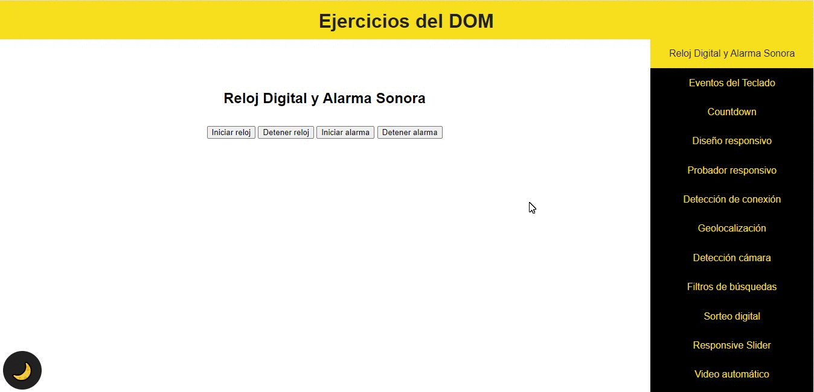

# Scroll-spy

This project is a continuation of Menu-hamburguesa-con-reloj, in which new features are added and modifications are made to the hamburger menu, leaving it fixed to one side and automatically indicating the section in which it is located within the project.

## Content

Scroll-spy is the continuation of the Menu-hamburguesa-con-reloj project, in which a lot of the content was being covered on the subject of DOM manipulation, by means of Javascript. In this project, functionalities such as voice narrator, form validation and automatic detection of the section where the user is located were added, highlighting it in the hamburger menu, among others...

### Built with

- Javascript
- HTML
- CSS
- SASS

### Libraries used

- Hamburgers: (https://jonsuh.com/hamburgers/)

### Page link

[click me](https://elkin-torres.github.io/Scroll-spy/Men-_hamburguesa_con_reloj-Version10/)